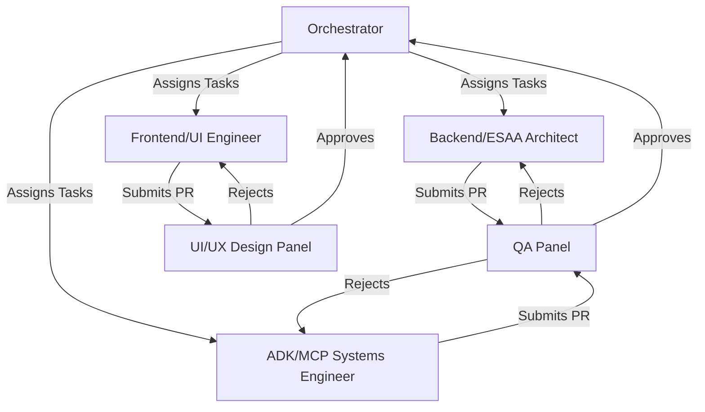

# Multi-Agent Architecture Design

## Overview
This document outlines the specialized multi-agent architecture for the execution of the VW Finance Control Tower project. The architecture uses parallel agent execution and dedicated expert committees to ensure high-quality, scalable delivery.

## Agent Hierarchy & Roles

### 1. The Orchestrator (Main Controller)
- **Role:** Central dispatcher and state manager.
- **Responsibilities:**
  - Break down project phases into actionable parallel tasks.
  - Coordinate handoffs between specialized agents.
  - Manage the dependency graph (e.g., ensuring ESAA engine is built before UI widgets).

### 2. Specialized Execution Agents
- **Backend/ESAA Architect (Code/Architect Modes):** Focuses entirely on Supabase schemas, Next.js API routes, and Event-Sourced Architecture (ESAA) logic.
- **Frontend/UI Engineer (Code Mode):** Focuses on React/Next.js components, Tailwind CSS styling, Recharts integration, and Framer Motion animations.
- **ADK/MCP Systems Engineer (Code Mode):** Specialized in Python, Google ADK, and deploying MCP toolsets for secure data access.

### 3. Expert Evaluation Committees
To guarantee rigorous product quality, completed tasks must pass through specific review panels before merging.

#### A. UI/UX Design Panel
- **Focus:** Visual fidelity, accessibility, and brand consistency.
- **Checks:**
  - Verifies VW Brand Theme adherence (VW Blue #001E50, Secondary #00B0F0).
  - Validates responsiveness and layout constraints.
  - Ensures Framer Motion animations match the desired "demo flow."

#### B. Quality Assurance (QA) Panel
- **Focus:** Functional testing, edge cases, and architectural integrity.
- **Checks:**
  - Tests Supabase RLS policies and ESAA event integrity.
  - Validates Next.js data fetching patterns and Zustand store state updates.
  - Reviews Python ADK skills against error boundaries.

## Execution Flow
1. **Planning:** Orchestrator assigns tasks to Execution Agents based on `todo.md`.
2. **Implementation:** Agents implement their specific domains in parallel.
3. **Review Loop:** Completed PRs/modules are passed to the QA and UI/UX committees.
4. **Approval:** If rejected, agents refine. If approved, the Orchestrator marks the task complete.

*(Note: Adherence to `gemini.md` and `Claude.md` standards will be strictly enforced during the Review Loop.)*